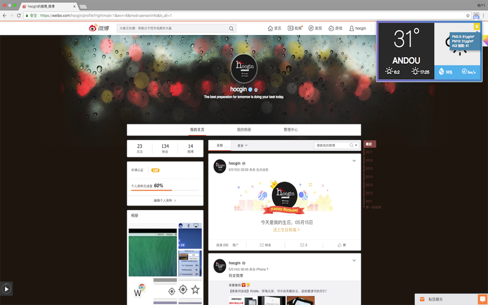

<h1 align="center">Weather For Chrome</h1>

# Install It
- 
- , and drag to the Chrome Extentions page with `develop mode` opened.

# Has What ? :)
- Badge Style  
  
  
  
- Weather more info
  
- Custom Settings

# ISSUES
[New ISSUES](https://github.com/hocgin/WeatherForChrome/issues/new)

# Author

# Q&A
- 为什么会出现404图标?
> 请检查请求频率是否过快，或更换私有的`APP ID` **作者使用的是免费的APP ID, 限制60次/min**

- 如何申请`APP ID`?
> 请移步[openweathermap.org](https://home.openweathermap.org/api_keys) 申请, 然后再填入`选项`中

# LICENSE

