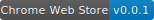

<h1 align="center">Weather For Chrome Plugin</h1>

# Install It
- 
- , and drag to the Chrome Extentions page with `develop mode` opened.

# Has What ? :)
- Badge Style  
  
  
  
- Weather more info
  
- Custom Settings

# ISSUES
[New ISSUES](https://github.com/hocgin/Weather-For-Chrome-Plugin/issues/new)

# LICENSE

