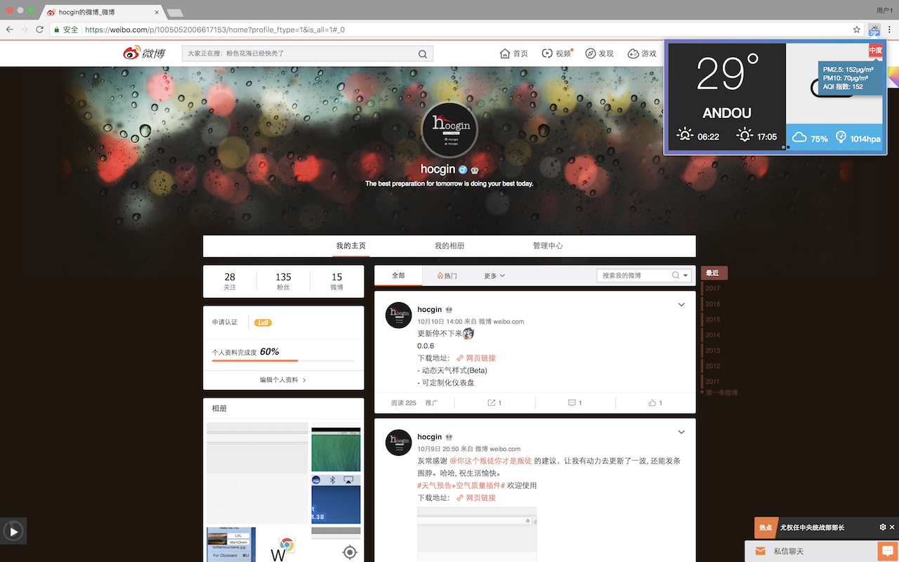
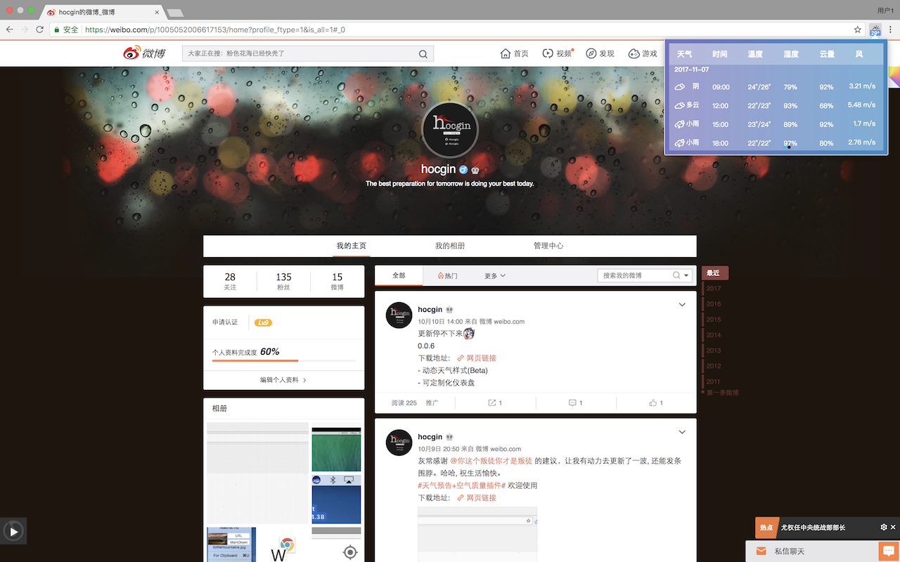
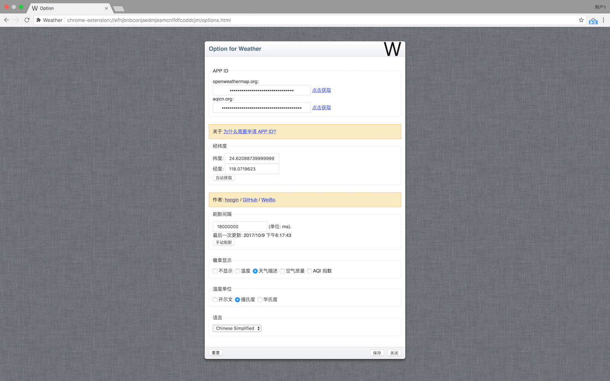

<h1 align="center">Weather For Chrome</h1>

# 更新日志
- 0.0.4 感谢 @wangbolizhong 提供的众多建议
    - 加入了空气质量
    - 优化了排序问题
    - 优化了温度问题
    - 加入若干设置
    - 优化了不健康代码
- 0.0.5 
    - 修复 aqicn.org APP ID 无法设置成功
- 0.0.6 更新狂魔
    - 动态天气显示(Beta)
    - 可定制化仪表盘 
- 0.0.7 感谢 @sgrjyb 提的建议
    - 修正日志 & 增加明显的网络错误提示
    - 增加天气预报
    - 优化空气质量面板颜色
- 0.0.8 (已发布)
    - 优化代码，修正bug
    - 新增面板刷新功能
    - 优化细节处理
- 0.2.0
    - 优化 使用 React 重写
    - 新增 自动定位
    

# Install It
- 
- , and drag to the Chrome Extentions page with `develop mode` opened.

# 演示(v0.0.7) :)

# Q&A
[反馈或建议](https://github.com/hocgin/WeatherForChrome/issues/new)

# LICENSE

