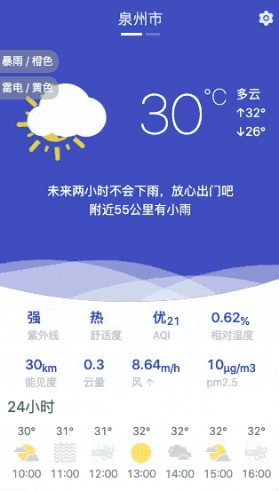

<h1 align="center">Chrome Extension Weather</h1>
<p align="center"></p>

### 安装

[](https://chrome.google.com/webstore/detail/weather/ibieofighcnndjcjchdahdiacjpmkhgf)
[](https://microsoftedge.microsoft.com/addons/detail/mmjibclgkfldbhbnpcfoigijmfippfgg)

### 项目开发和本地安装

1. 编译插件

```bash
# 指定 node 版本
npm install -g n
sudo n 9.0.0
# 安装依赖环境
npm install
# 运行
npm start
```

2. 如果安装, 启用`开发模式`，加载 dist 目录即可。

3. 打包插件

- 3.1 打包插件(需编译后)

```bash
./scripts/build.sh
```

- 3.2 触发自动构建打包

```bash
./scripts/pushtag.sh v3.1.7
```

### 更新日志

- [更新日志](CHANGELOG.md)

### 演示 :)



### Q&A

[反馈或建议](https://github.com/hocgin/chrome-extension-weather/issues/new)

### 联系作者


